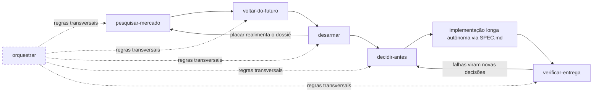

# LL Skills

Coleção de skills para [Claude Code](https://claude.com/claude-code) que forma um **pipeline de desenvolvimento orientado a evidência**: da ideia à entrega verificada, com o mínimo de retrabalho e o máximo de decisões tomadas com lastro — antes de custar caro.

## Instalação

Dentro do Claude Code:

```
/plugin marketplace add allangdy/ll-skills
/plugin install ll-skills@ll-skills
```

As skills são invocadas automaticamente pelo Claude quando o pedido bate com a description delas, ou manualmente (ex.: `/ll-skills:decidir-antes`).

### Atualizações

Cada `git push` neste repositório é uma nova versão. Para receber automaticamente: `/plugin` → aba **Marketplaces** → ativar *auto-update* no `ll-skills`. Manualmente: `/plugin marketplace update ll-skills` + `/plugin update ll-skills@ll-skills`.

## O fluxo completo



Cada etapa produz o insumo da seguinte, mas **toda skill funciona sozinha** — os handoffs são detectados pelos artefatos no repositório (`docs/`, placar, `SPEC.md`), nunca por acoplamento rígido.

### Para um projeto novo

1. **`pesquisar-mercado`** — antes de qualquer código: dossiê indexado em `docs/` (mercado, dores, concorrentes, preços sem âncora, viabilidade, economia unitária), com força de evidência por linha. Termina com as **decisões em aberto** e as **premissas ordenadas por letalidade**.
2. **`voltar-do-futuro`** — o premortem: um agente narra do futuro por que o projeto morreu, atacando o que nunca foi medido. Cada falha traz o aviso que já existia, o viés que cegou e o **teste barato com critério de aceite** que a desarma. As premissas do dossiê são metade do insumo.
3. **`desarmar`** — executa os testes desarmadores e as POCs com aceite pré-registrado ("reprova primeiro") e preenche o **placar**: DESARMADA, CONFIRMADA COM ROTA DE SAÍDA, EM CURSO… Os números medidos realimentam o dossiê.
4. **`decidir-antes`** — com os riscos desarmados, a entrevista de decisões: perguntas via AskUserQuestion priorizadas por irreversibilidade × impacto (recomendações sempre com lastro — dos mapas do código ou de pesquisa web), consolidadas em **`SPEC.md` + `PROGRESS.md`** com protocolo anti-drift embutido. Decisões já tomadas nas etapas anteriores não são re-perguntadas.
5. **Implementação longa** — um agente autônomo (horas ou dias) parte do `SPEC.md`, que é autossuficiente: contrato de decisões, critérios verificáveis por comando, marcos, protocolo de escalada. Não é uma skill — é qualquer sessão/agente com a instrução de partida.
6. **`verificar-entrega`** — auditoria de contexto limpo: um verificador que nunca viu o raciocínio da implementação roda os comandos de aceite da SPEC um a um e confere o placar de marcos contra o código real. O auto-relato de agentes degrada em execuções longas; esta etapa é o que transforma "pronto" em pronto.

### Para uma feature de um sistema existente

O mesmo pipeline, encurtado — `pesquisar-mercado` detecta o modo no enquadramento:

1. **`pesquisar-mercado` (modo feature)** — os dados internos entram como fonte de primeira classe (uso real, tickets, churn, pedidos de clientes = preferência revelada), mais gap competitivo da capacidade e impacto em preço/empacotamento. Desfecho: **construir / construir diferente / não construir**.
2. **`voltar-do-futuro`** — opcional; vale quando a feature é cara, irreversível ou toca contrato de dados.
3. **`desarmar`** → **`decidir-antes`** → implementação → **`verificar-entrega`**, como no fluxo novo.

Para uma correção pequena ou tarefa trivial, nada disso: o pipeline existe para trabalho onde errar estrutura custa caro.

### Transversal

**`orquestrar`** vale em qualquer etapa: quando delegar a subagentes (e quando não), anatomia de briefs, roteamento de modelos por etapa, verificação com contexto limpo e evidência.

## Skills

| Skill | Etapa | Descrição |
|---|---|---|
| `pesquisar-mercado` | 1 | Dossiê de mercado orientado a decisão — projeto novo ou feature de sistema existente |
| `voltar-do-futuro` | 2 | Premortem narrado do futuro: falhas com aviso, viés e teste desarmador |
| `desarmar` | 3 | Executa testes desarmadores e POCs com aceite pré-registrado e preenche o placar |
| `decidir-antes` | 4 | Entrevista de decisões → SPEC.md + PROGRESS.md para implementação autônoma longa |
| `verificar-entrega` | 6 | Auditoria de contexto limpo da entrega contra os critérios da SPEC |
| `orquestrar` | — | Regras de orquestração multi-agente: delegação, briefs, roteamento, verificação |

## Adicionando novas skills

1. Crie `skills/<nome-da-skill>/SKILL.md` com frontmatter `name` (kebab-case) e `description` (diz ao Claude **quando** invocar)
2. Material de profundidade vai em `skills/<nome>/referencias/`, lido no momento certo
3. Atualize a tabela acima e faça commit + push — quem tem auto-update recebe
