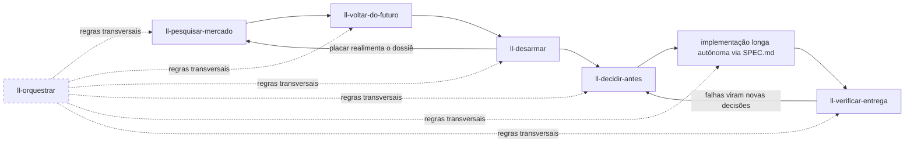

# LL Skills

Coleção de skills para [Claude Code](https://claude.com/claude-code) que forma um **pipeline de desenvolvimento orientado a evidência**: da ideia à entrega verificada, com o mínimo de retrabalho e o máximo de decisões tomadas com lastro — antes de custar caro.

## Instalação

Requer [Node.js](https://nodejs.org) 18+ (o mesmo que o Claude Code já usa).

```bash
npx ll-skills@latest
```

Reinicie o Claude Code ao final. As skills são invocadas automaticamente quando o pedido bate com a description delas, ou manualmente pelo nome (ex.: `/ll-decidir-antes`). Por serem skills standalone, e não de plugin, **não carregam o prefixo `ll-skills:`** — é por isso que o ll-skills não é distribuído como plugin do Claude Code.

Outras formas:

```bash
npx ll-skills@latest --local           # instala em ./.claude, só para o projeto atual
npx ll-skills@latest --uninstall       # remove tudo que o instalador colocou
npx github:allangdy/ll-skills          # direto do repositório (commit atual do main), sem passar pelo npm
CLAUDE_CONFIG_DIR=/outro/dir npx ll-skills@latest   # honra o diretório de configuração alternativo
```

### O que o instalador faz

`bin/install.js` é Node puro, sem dependências e sem perguntas. Cada execução, na ordem:

1. **Remove o formato antigo.** Se o plugin `ll-skills@ll-skills` (marketplace) estiver instalado, roda `claude plugin uninstall` em cada escopo e `claude plugin marketplace remove`. Isso acontece antes de tocar em `settings.json`, porque o CLI do Claude reescreve esse arquivo.
2. **Copia os arquivos** do pacote para o diretório de configuração (`$CLAUDE_CONFIG_DIR` ou `~/.claude`).
3. **Poda órfãos.** Todo arquivo listado no manifesto da instalação anterior que não existe mais no pacote é apagado. Só caminhos próprios (`skills/ll-*`, `agents/ll-*`, `hooks/ll-skills-*`) são tocados; nada alheio é removido.
4. **Registra o hook** de aviso de atualização em `settings.json`, uma única entrada, sem duplicar em reinstalações e sem alterar os outros hooks do arquivo. Antes da primeira escrita, grava `settings.json.ll-skills.bak`.
5. **Grava o estado** e limpa o cache da versão anterior.

| Caminho (relativo a `~/.claude`) | Conteúdo |
|---|---|
| `skills/ll-*/` | as skills, uma pasta por skill, com `SKILL.md` e `referencias/` |
| `agents/ll-implementador.md` | o agente implementador |
| `hooks/ll-skills-check-update.js` | o hook de aviso de atualização |
| `ll-skills/VERSION` | versão instalada (semver) |
| `ll-skills/manifest.json` | lista de arquivos instalados com sha256, base da poda e do `--uninstall` |
| `ll-skills/install.json` | origem da instalação: `registry`, `github` ou `local`, com o commit quando houver |
| `settings.json` → `hooks.SessionStart` | uma entrada com `matcher: "startup\|resume"` chamando o hook |

Se `settings.json` estiver inválido, o instalador instala tudo, **não toca no arquivo**, imprime o trecho para colar à mão e sai com código 1. Se o CLI `claude` não estiver no PATH e houver plugin legado, imprime os comandos para você rodar.

### Atualizações

Cada versão publicada no npm é uma nova versão. O hook `ll-skills-check-update.js` roda no início de cada sessão em dois modos:

- **Leitor** (foreground, sem rede, ~30 ms): lê o cache da última checagem e, se a versão publicada for maior que a instalada, emite um aviso curto na sessão pedindo `/ll-atualizar`.
- **Worker** (background, com rede, no máximo a cada 6 horas): consulta `npm view ll-skills version` e regrava o cache em `~/.cache/ll-skills/update-check.json`. Se o pacote não estiver acessível no npm mas a instalação veio de `npx github:`, compara o commit instalado com o `HEAD` do repositório.

Qualquer falha (sem rede, sem npm, sem cache) termina em silêncio: o hook nunca atrasa a sessão nem escreve fora do próprio cache.

`/ll-atualizar` compara instalado × publicado, mostra as seções do `CHANGELOG.md` entre as duas versões e roda `npx --yes ll-skills@latest`, que faz tudo acima de novo. Manualmente, o mesmo comando.

### Migrando do formato plugin

Quem instalou pelo marketplace (`/plugin install ll-skills@ll-skills`) só precisa rodar `npx ll-skills@latest`: o instalador desinstala o plugin, remove o marketplace e limpa as chaves `enabledPlugins` e `extraKnownMarketplaces` do `settings.json`. As skills passam de `/ll-skills:<nome>` para `/ll-<nome>`.

## O fluxo completo



Cada etapa produz o insumo da seguinte, mas **toda skill funciona sozinha** — os handoffs são detectados pelos artefatos no repositório (`docs/`, placar, `SPEC.md`), nunca por acoplamento rígido.

### Para um projeto novo

1. **`ll-pesquisar-mercado`** — antes de qualquer código: dossiê indexado em `docs/` (mercado, dores, concorrentes, preços sem âncora, viabilidade, economia unitária), com força de evidência por linha. Termina com as **decisões em aberto** e as **premissas ordenadas por letalidade**.
2. **`ll-voltar-do-futuro`** — o premortem: um agente narra do futuro por que o projeto morreu, atacando o que nunca foi medido. Cada falha traz o aviso que já existia, o viés que cegou e o **teste barato com critério de aceite** que a desarma. As premissas do dossiê são metade do insumo.
3. **`ll-desarmar`** — executa os testes desarmadores e as POCs com aceite pré-registrado ("reprova primeiro") e preenche o **placar**: DESARMADA, CONFIRMADA COM ROTA DE SAÍDA, EM CURSO… Os números medidos realimentam o dossiê.
4. **`ll-decidir-antes`** — com os riscos desarmados, a entrevista de decisões: perguntas via AskUserQuestion priorizadas por irreversibilidade × impacto (recomendações sempre com lastro — dos mapas do código ou de pesquisa web), consolidadas em **`SPEC.md` + `PROGRESS.md`** com protocolo anti-drift embutido. Decisões já tomadas nas etapas anteriores não são re-perguntadas.
5. **Implementação longa** — um agente autônomo (horas ou dias) parte do `SPEC.md`, que é autossuficiente: contrato de decisões, critérios verificáveis por comando, marcos, protocolo de escalada. O ll-skills inclui o agente **`ll-implementador`**, que já parte com a `ll-orquestrar` pré-carregada — mas qualquer sessão/agente com a instrução de partida serve.
6. **`ll-verificar-entrega`** — auditoria de contexto limpo: um verificador que nunca viu o raciocínio da implementação roda os comandos de aceite da SPEC um a um e confere o placar de marcos contra o código real. O auto-relato de agentes degrada em execuções longas; esta etapa é o que transforma "pronto" em pronto.

### Para uma feature de um sistema existente

O mesmo pipeline, encurtado — `ll-pesquisar-mercado` detecta o modo no enquadramento:

1. **`ll-pesquisar-mercado` (modo feature)** — os dados internos entram como fonte de primeira classe (uso real, tickets, churn, pedidos de clientes = preferência revelada), mais gap competitivo da capacidade e impacto em preço/empacotamento. Desfecho: **construir / construir diferente / não construir**.
2. **`ll-voltar-do-futuro`** — opcional; vale quando a feature é cara, irreversível ou toca contrato de dados.
3. **`ll-desarmar`** → **`ll-decidir-antes`** → implementação → **`ll-verificar-entrega`**, como no fluxo novo.

Para uma correção pequena ou tarefa trivial, nada disso: o pipeline existe para trabalho onde errar estrutura custa caro.

### Transversais

**`ll-pesquisar`** — pesquisa profunda de qualquer tema (técnica, comparativo de ferramenta, prática nova — ex.: GEO), em qualquer ponto do fluxo. Pesquisadores de contexto limpo com busca web entregam duas camadas: `SINTESE.md` acionável (fatos → backlog APPLY → decisões DISCUSS → gates de medição) e a trilha de evidências por frente com fontes e trechos salvos, para um agente futuro se aprofundar sem refazer a busca. A síntese é a base natural para a entrevista do `ll-decidir-antes` — a invocação da próxima skill é sempre sua.

**`ll-orquestrar`** vale em qualquer etapa que use subagentes — mas é na **implementação longa** que ele mais trabalha: é o manual de como o implementador decompõe por fronteiras de contexto, delega, roteia modelos e verifica com contexto limpo durante horas ou dias. Nas demais etapas, rege os pesquisadores, narradores e verificadores que as skills despacham.

## Skills

| Skill | Etapa | Descrição |
|---|---|---|
| `ll-pesquisar-mercado` | 1 | Dossiê de mercado orientado a decisão — projeto novo ou feature de sistema existente |
| `ll-voltar-do-futuro` | 2 | Premortem narrado do futuro: falhas com aviso, viés e teste desarmador |
| `ll-desarmar` | 3 | Executa testes desarmadores e POCs com aceite pré-registrado e preenche o placar |
| `ll-decidir-antes` | 4 | Entrevista de decisões → SPEC.md + PROGRESS.md para implementação autônoma longa |
| `ll-verificar-entrega` | 6 | Auditoria de contexto limpo da entrega contra os critérios da SPEC |
| `ll-pesquisar` | — | Pesquisa profunda de qualquer tema em duas camadas: síntese acionável + trilha de evidências reutilizável |
| `ll-orquestrar` | — | Regras de orquestração multi-agente: delegação, briefs, roteamento, verificação |
| `ll-atualizar` | — | Atualiza o ll-skills para a última versão publicada, com o changelog do que mudou antes de aplicar |

## Adicionando novas skills

1. Crie `skills/ll-<nome>/SKILL.md` com frontmatter `name: ll-<nome>` (kebab-case, igual ao nome da pasta) e `description` (diz ao Claude **quando** invocar)
2. Material de profundidade vai em `skills/ll-<nome>/referencias/`, lido no momento certo
3. Atualize a tabela acima e registre a mudança em `CHANGELOG.md`, na seção `## [Unreleased]` (vira a seção da versão na hora do release)
4. Publique uma versão (abaixo). O hook avisa quem está atrasado na próxima sessão.

O instalador (`bin/install.js`) descobre as skills pela pasta `skills/ll-*` e os agentes por `agents/ll-*.md`; não há lista para manter. `npm test` roda o smoke test do instalador num diretório isolado.

## Publicando uma versão

A publicação no npm é feita pela CI via [Trusted Publishing](https://docs.npmjs.com/trusted-publishers): GitHub Actions troca um token OIDC com o npm no momento do publish. **Nenhum token do npm fica guardado**, nem no GitHub, nem na máquina de ninguém, e cada versão sai com [proveniência](https://docs.npmjs.com/generating-provenance-statements) assinada.

### Rotina

```bash
# 1. edite as skills; no CHANGELOG.md, renomeie a seção ## [Unreleased] para ## [x.y.z] - AAAA-MM-DD
# 2. suba a versão: cria o commit e a tag vX.Y.Z
npm version patch|minor|major -m "Versão %s"
# 3. o push da tag dispara a publicação
git push --follow-tags origin main
```

Regra de bump: `patch` para ajuste em skill existente, `minor` para skill nova ou mudança de comportamento, `major` para renomear ou remover skill.

### O que a CI faz

- `.github/workflows/ci.yml`, em todo push e PR: `npm test` (smoke test do instalador).
- `.github/workflows/publish.yml`, em toda tag `vX.Y.Z`:
  1. confere que a tag, a versão do `package.json` e a seção do `CHANGELOG.md` coincidem — falha se o changelog não tiver a seção;
  2. roda o smoke test;
  3. `npm publish` via OIDC, pulando se a versão já existir no registro (reexecuções são seguras);
  4. confirma que a versão apareceu no registro, esperando a propagação por até 60 segundos.

O smoke test (`scripts/smoke-test.sh`) instala num `CLAUDE_CONFIG_DIR` temporário com um `settings.json` que já tem hook alheio e plugin legado, e verifica: skills e agente instalados, hook executável, `VERSION` igual ao `package.json`, poda do órfão próprio, preservação do alheio, hook registrado uma só vez, segunda instalação sem diff, aviso do hook com versão nova, e `--uninstall` limpo.

### Configuração inicial (feita uma vez)

1. A **primeira versão** de um pacote novo precisa ser publicada manualmente, porque o Trusted Publisher é configurado nas *Package settings*, que só existem depois que o pacote existe: `npm publish --access public` num terminal comum, com a conta npm em 2FA.
2. Em `https://www.npmjs.com/package/ll-skills/access`, seção **Trusted Publisher**, GitHub Actions com exatamente:

   | Campo | Valor |
   |---|---|
   | Organization or user | `allangdy` (usuário do **GitHub**, não do npm) |
   | Repository | `ll-skills` |
   | Workflow filename | `publish.yml` (só o nome, sem `.github/workflows/`) |
   | Environment name | vazio |

   Se a CI falhar com `OIDC token exchange error - package not found`, é algum desses campos divergindo. A configuração não é editável: exclua e crie de novo.
3. Na mesma página, em **Publishing access**, "Require two-factor authentication and disallow tokens". Isso bloqueia publicação por token; a CI (OIDC) e a publicação interativa com 2FA continuam funcionando.
4. Exigências do runner: npm ≥ 11.5.1 e Node ≥ 22.14. O workflow usa Node 24 e atualiza o npm antes de publicar.
