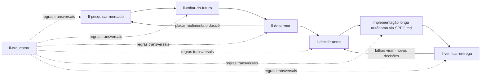

# LL Skills

Coleção de skills para [Claude Code](https://claude.com/claude-code) que forma um **pipeline de desenvolvimento orientado a evidência**: da ideia à entrega verificada, com o mínimo de retrabalho e o máximo de decisões tomadas com lastro — antes de custar caro.

## Instalação

Requer [Node.js](https://nodejs.org) 18+ (o mesmo que o Claude Code já usa).

```bash
npx ll-skills@latest
```

O instalador copia as skills para `~/.claude/skills/ll-*`, o agente para `~/.claude/agents/` e registra um hook de aviso de atualização em `~/.claude/settings.json`. Se houver uma instalação anterior (inclusive o antigo formato de plugin por marketplace), ela é removida na mesma passada. Reinicie o Claude Code ao final.

As skills são invocadas automaticamente pelo Claude quando o pedido bate com a description delas, ou manualmente pelo nome (ex.: `/ll-decidir-antes`). Por serem skills standalone, e não de plugin, não carregam o prefixo `ll-skills:`.

Outras formas:

```bash
npx github:allangdy/ll-skills          # direto do repositório, sem passar pelo registro npm
npx ll-skills@latest --local           # instala em ./.claude, só para o projeto atual
npx ll-skills@latest --uninstall       # remove tudo que o instalador colocou
CLAUDE_CONFIG_DIR=/outro/dir npx ll-skills@latest   # honra o diretório de configuração alternativo
```

### Atualizações

Cada versão publicada no npm é uma nova versão. O ll-skills **avisa no início da sessão** quando a versão instalada ficou para trás, e `/ll-atualizar` atualiza por dentro do Claude, mostrando o changelog antes de aplicar. Manualmente: `npx ll-skills@latest` de novo.

## O fluxo completo



Cada etapa produz o insumo da seguinte, mas **toda skill funciona sozinha** — os handoffs são detectados pelos artefatos no repositório (`docs/`, placar, `SPEC.md`), nunca por acoplamento rígido.

### Para um projeto novo

1. **`ll-pesquisar-mercado`** — antes de qualquer código: dossiê indexado em `docs/` (mercado, dores, concorrentes, preços sem âncora, viabilidade, economia unitária), com força de evidência por linha. Termina com as **decisões em aberto** e as **premissas ordenadas por letalidade**.
2. **`ll-voltar-do-futuro`** — o premortem: um agente narra do futuro por que o projeto morreu, atacando o que nunca foi medido. Cada falha traz o aviso que já existia, o viés que cegou e o **teste barato com critério de aceite** que a desarma. As premissas do dossiê são metade do insumo.
3. **`ll-desarmar`** — executa os testes desarmadores e as POCs com aceite pré-registrado ("reprova primeiro") e preenche o **placar**: DESARMADA, CONFIRMADA COM ROTA DE SAÍDA, EM CURSO… Os números medidos realimentam o dossiê.
4. **`ll-decidir-antes`** — com os riscos desarmados, a entrevista de decisões: perguntas via AskUserQuestion priorizadas por irreversibilidade × impacto (recomendações sempre com lastro — dos mapas do código ou de pesquisa web), consolidadas em **`SPEC.md` + `PROGRESS.md`** com protocolo anti-drift embutido. Decisões já tomadas nas etapas anteriores não são re-perguntadas.
5. **Implementação longa** — um agente autônomo (horas ou dias) parte do `SPEC.md`, que é autossuficiente: contrato de decisões, critérios verificáveis por comando, marcos, protocolo de escalada. O ll-skills inclui o agente **`ll-implementador`**, que já parte com a `ll-orquestrar` pré-carregada — mas qualquer sessão/agente com a instrução de partida serve.
6. **`ll-verificar-entrega`** — auditoria de contexto limpo: um verificador que nunca viu o raciocínio da implementação roda os comandos de aceite da SPEC um a um e confere o placar de marcos contra o código real. O auto-relato de agentes degrada em execuções longas; esta etapa é o que transforma "pronto" em pronto.

### Para uma feature de um sistema existente

O mesmo pipeline, encurtado — `ll-pesquisar-mercado` detecta o modo no enquadramento:

1. **`ll-pesquisar-mercado` (modo feature)** — os dados internos entram como fonte de primeira classe (uso real, tickets, churn, pedidos de clientes = preferência revelada), mais gap competitivo da capacidade e impacto em preço/empacotamento. Desfecho: **construir / construir diferente / não construir**.
2. **`ll-voltar-do-futuro`** — opcional; vale quando a feature é cara, irreversível ou toca contrato de dados.
3. **`ll-desarmar`** → **`ll-decidir-antes`** → implementação → **`ll-verificar-entrega`**, como no fluxo novo.

Para uma correção pequena ou tarefa trivial, nada disso: o pipeline existe para trabalho onde errar estrutura custa caro.

### Transversais

**`ll-pesquisar`** — pesquisa profunda de qualquer tema (técnica, comparativo de ferramenta, prática nova — ex.: GEO), em qualquer ponto do fluxo. Pesquisadores de contexto limpo com busca web entregam duas camadas: `SINTESE.md` acionável (fatos → backlog APPLY → decisões DISCUSS → gates de medição) e a trilha de evidências por frente com fontes e trechos salvos, para um agente futuro se aprofundar sem refazer a busca. A síntese é a base natural para a entrevista do `ll-decidir-antes` — a invocação da próxima skill é sempre sua.

**`ll-orquestrar`** vale em qualquer etapa que use subagentes — mas é na **implementação longa** que ele mais trabalha: é o manual de como o implementador decompõe por fronteiras de contexto, delega, roteia modelos e verifica com contexto limpo durante horas ou dias. Nas demais etapas, rege os pesquisadores, narradores e verificadores que as skills despacham.

## Skills

| Skill | Etapa | Descrição |
|---|---|---|
| `ll-pesquisar-mercado` | 1 | Dossiê de mercado orientado a decisão — projeto novo ou feature de sistema existente |
| `ll-voltar-do-futuro` | 2 | Premortem narrado do futuro: falhas com aviso, viés e teste desarmador |
| `ll-desarmar` | 3 | Executa testes desarmadores e POCs com aceite pré-registrado e preenche o placar |
| `ll-decidir-antes` | 4 | Entrevista de decisões → SPEC.md + PROGRESS.md para implementação autônoma longa |
| `ll-verificar-entrega` | 6 | Auditoria de contexto limpo da entrega contra os critérios da SPEC |
| `ll-pesquisar` | — | Pesquisa profunda de qualquer tema em duas camadas: síntese acionável + trilha de evidências reutilizável |
| `ll-orquestrar` | — | Regras de orquestração multi-agente: delegação, briefs, roteamento, verificação |
| `ll-atualizar` | — | Atualiza o ll-skills para a última versão publicada, com o changelog do que mudou antes de aplicar |

## Adicionando novas skills

1. Crie `skills/ll-<nome>/SKILL.md` com frontmatter `name: ll-<nome>` (kebab-case, igual ao nome da pasta) e `description` (diz ao Claude **quando** invocar)
2. Material de profundidade vai em `skills/ll-<nome>/referencias/`, lido no momento certo
3. Atualize a tabela acima, registre a mudança em `CHANGELOG.md`, suba a versão em `package.json` e publique: `npm publish`. O hook avisa quem está atrasado na próxima sessão.

O instalador (`bin/install.js`) descobre as skills pela pasta `skills/ll-*` e os agentes por `agents/ll-*.md`; não há lista para manter.
